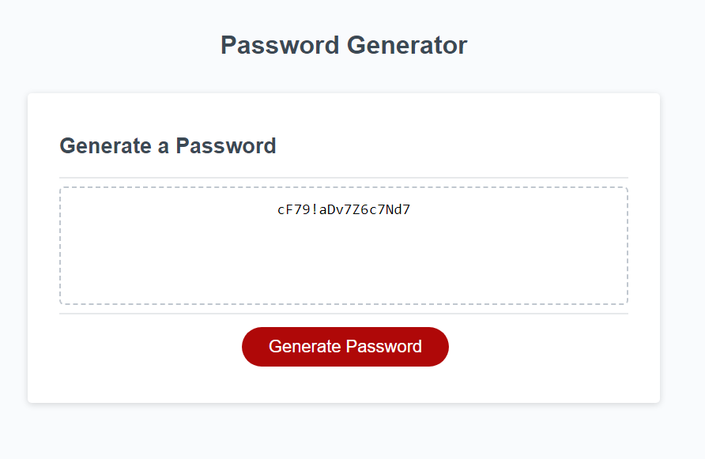

# Password-Generator
This is my password generator, I created it using HTML, CSS, and JavaScript.

## Description
This application will prompt a user for their desired password length, if they want uppercase, lowercase, numbers, and/or symbols in their password, and then it will create the password based on the given criteria.

## Screenshot & Links

[Github Repo](https://github.com/NickFierke/password-generator)\
[Live URL](https://nickfierke.github.io/password-generator/)

